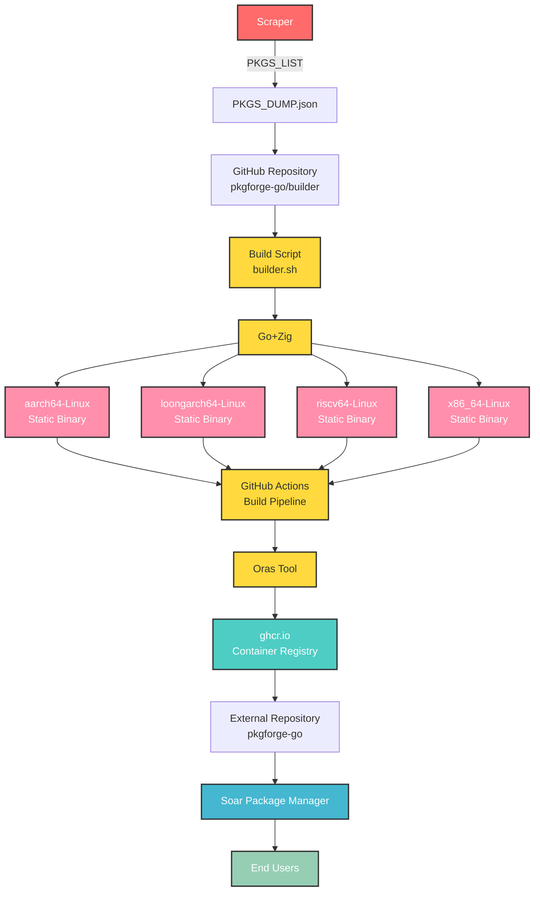

<div align="center">

[discord-shield]: https://img.shields.io/discord/1313385177703256064?logo=%235865F2&label=discord
[discord-url]: https://discord.gg/djJUs48Zbu
[doc-shield]: https://img.shields.io/badge/docs-soar.qaidvoid.dev-blue
[doc-url]: https://soar.qaidvoid.dev
[issues-shield]: https://img.shields.io/github/issues/pkgforge-go/builder.svg
[issues-url]: https://github.com/pkgforge-go/builder/issues
[license-shield]: https://img.shields.io/github/license/pkgforge-go/builder.svg
[license-url]: https://github.com/pkgforge-go/builder/blob/main/LICENSE
[stars-shield]: https://img.shields.io/github/stars/pkgforge-go/builder.svg
[stars-url]: https://github.com/pkgforge-go/builder/stargazers

[![Discord][discord-shield]][discord-url]
[![Documentation][doc-shield]][doc-url]
[![Issues][issues-shield]][issues-url]
[![License: MIT][license-shield]][license-url]
[![Stars][stars-shield]][stars-url]

</div>

<p align="center">
    <a href="https://soar.qaidvoid.dev/installation">
        
    </a><br>
</p>

<h4 align="center">
  <a href="https://soar.qaidvoid.dev">📘 Documentation</a> |
  <a href="https://docs.pkgforge.dev">🔮 PackageForge</a>
</h4>

<p align="center">
    Soar is a Fast, Modern, Bloat-Free Distro-Independent Package Manager that <a href="https://docs.pkgforge.dev/soar/comparisons"> <i>Just Works</i></a><br>
    Supports <a href="https://docs.pkgforge.dev/formats/binaries/static">Static Binaries</a>, <a href="https://docs.pkgforge.dev/formats/packages/appimage">AppImages</a>, and other <a href="https://docs.pkgforge.dev/formats/packages">Portable formats</a> on any <a href="https://docs.pkgforge.dev/repositories/soarpkgs/faq#portability"><i>*Unix-based</i> Distro</a>
</p>


## ℹ️ About
This repo, scrapes Go Packages from variety of sources & builds them as Statically Linked relocatable binaries for `aarch64-Linux`, `loongarch64-Linux`, `riscv64-Linux` & `x86_64-Linux`.<br>
The [build script](https://github.com/pkgforge-go/builder/blob/main/scripts/builder.sh) uses [Zig](https://zig.guide/working-with-c/zig-cc/) to compile the packages on [Github Actions](https://github.com/pkgforge-go/builder/actions) & then uploads the artifacts to [ghcr.io](https://github.com/orgs/pkgforge-go/packages?repo_name=builder) using [Oras](https://github.com/oras-project/oras).<br>
All of which are downloadable & installable with soar by adding `pkgforge-go` as an [external repo](https://docs.pkgforge.dev/repositories/external/pkgforge-go).

## 🏗️ Build Constraints
- [X] Must have a source published publicly, preferably [`Github`](https://github.com/search?q=lang%3Ago&type=repositories)
- [X] [Must be CLI (No library)](https://pkg.go.dev/)
- [X] Statically Linked
- [X] [CGO](https://pkg.go.dev/cmd/cgo): `CGO_ENABLED=1 CGO_CFLAGS=-O2 -flto=auto -fPIE -fpie -static -w -pipe`
- [X] [Buildmode PIE](https://pkg.go.dev/cmd/go#hdr-Build_modes): `-buildmode=pie`
- [X] Stripped: `-extldflags -s -w -static-pie -Wl,--build-id=none`
- [X] Updated: Packages older than last year i.e `date -d 'last year' '+%Y-01-01'` are dropped.
- [X] Little/No Dependency on system libraries: Crates depending on system libraries will simply fail.

```bash
  ==> CC: zig cc -target ${target_triplet}
  ==> CGO_CFLAGS: -O2 -flto=auto -fPIE -fpie -static -w -pipe
  ==> CGO_ENABLED: 1
  ==> CXX: zig c++ -target ${target_triplet}
  ==> GOARCH: $(uname -m)
  ==> GOOS: linux
  ==> LDFLAGS: -s -w -buildid= -linkmode=external
  ==> EXT_LDFLAGS: -s -w -static-pie -Wl,--build-id=none
  ==> GO_TAGS: netgo,osusergo
  ==> GO_BUILD: go build -a -v -x -trimpath -buildmode="pie" -buildvcs="false"
```

## 🤖 Hosts & 🐹 Targets
| 🤖 `HOST_TRIPLET` | 🐹 `GO_TARGET` |
|----------------|---------------|
| `aarch64-Linux` | `linux/arm64` |
| `loongarch64-Linux` | `linux/loong64` |
| `riscv64-Linux` | `linux/riscv64` |
| `x86_64-Linux` | `linux/amd64` |

## 🧰 Stats
> [!NOTE]
> - ℹ️ It is usual for most workflow run to `fail` since it's rare a package builds for ALL `hosts`<br>
> - 🗄️ Table of Packages (Sorted by Rank): https://github.com/pkgforge-go/builder/blob/main/data/PKG_INFO.md<br>
> - 📜 List of Packages (Tried Building): https://github.com/pkgforge-go/builder/blob/main/data/QUEUE_LIST.txt
> - 📜 List of Packages (Actually Built): https://github.com/pkgforge-go/builder/blob/main/data/CACHE_LIST.txt
> - A single Package may provide several `executables`, i.e they are counted individually per `host`

| Source 🗃️ | Total Packages 📦 |
|------------|-------------------|
| 🐹 [**Packages (`Total Scraped`)**](https://github.com/pkgforge-go/builder/blob/main/data/REPO_DUMP.json) | [](#) |
| 🐹 [**Packages (`CLI Only`)**](https://github.com/pkgforge-go/builder/blob/main/data/PKGS_CLI_ONLY.json) | [](#) |
| 🐹 [**Packages (`Built`)**](https://github.com/pkgforge-go/builder/blob/main/data/PKGS_BUILT.json) | [](#) |
| 🐹 [**Packages (`Queued`)**](https://github.com/pkgforge-go/builder/blob/main/data/QUEUE_LIST.txt) | [](#) |
| 🐹 [**Packages (`aarch64-Linux`)**](https://github.com/pkgforge-go/builder/blob/main/data/aarch64-Linux.json) | [](#) |
| 🐹 [**Packages (`loongarch64-Linux`)**](https://github.com/pkgforge-go/builder/blob/main/data/loongarch64-Linux.json) | [](#) |
| 🐹 [**Packages (`riscv64-Linux`)**](https://github.com/pkgforge-go/builder/blob/main/data/riscv64-Linux.json) | [](#) |
| 🐹 [**Packages (`x86_64-Linux`)**](https://github.com/pkgforge-go/builder/blob/main/data/x86_64-Linux.json) | [](#) |
| 🐹 [**Packages (`Success Rate`)**](https://github.com/pkgforge-go/builder/blob/main/data/QUEUE_LIST.txt) | [](#) <sup>**`%`**</sup> |
| 🐹 [**Packages (`Total Built`)**](https://github.com/orgs/pkgforge-go/packages?repo_name=builder) | [](#) |

## 🔒 Security
- Package Sources are recorded & embedded in metadata.
- CI/CD run on [Github Actions](https://docs.github.com/en/actions/security-for-github-actions/security-guides/security-hardening-for-github-actions)
- Build Logs are viewable using `soar log ${PKG_NAME}`
- Build Src is downloadable by downloading: [`{GHCR_PKG}-srcbuild-${BUILD_ID}`](https://github.com/orgs/pkgforge-go/packages?tab=packages&q=srcbuild)
- [Artifact Attestation](https://github.com/pkgforge-go/builder/attestations) & [Build Provenance](https://github.com/pkgforge-go/builder/attestations) are created/updated per build.

## 🟢 Workflow


